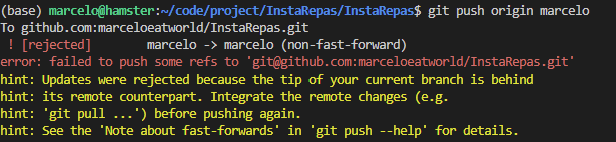

# Cree votre branche github:

```php
git checkout -b nom_de_votre_branche
```
1. Apres avoir modifier un fichier : 
Vérifiez l'état de vos modifications : 
```php
git status
```
2. Ajoutez les fichiers modifiés à l'index pour qu'ils soient prêts à être enregistrés en utilisant la commande suivante :
```php
git add nom_du_fichier_modifié
```
### Notez que vous pouvez également utiliser (git add .) pour ajouter tous les fichiers modifiés de votre répertoire de travail.
 
3. Enregistrez les modifications en utilisant la commande suivante :
```php
git commit -m "Description de vos modifications"
```
4. Enfin, poussez les modifications sur votre branche distante en utilisant la commande suivante :
```php
git push origin nom_de_votre_branche
```
---

### Travailler en équipe avec Git implique généralement de travailler sur des branches distinctes pour chaque fonctionnalité ou correction, puis de fusionner ces branches dans la branche principale (généralement main ou master) une fois que le travail est terminé et validé

1. Assurez-vous que votre dépôt local est à jour en récupérant les dernières modifications du dépôt distant :

```php
git fetch origin
```
2. Passez à la branche principale (par exemple, main) :

```php
git checkout main
```

3. Récupérez les dernières modifications de la branche principale distante et fusionnez-les avec votre branche principale locale :

```php
git pull origin main

```
4. Créez une nouvelle branche pour votre fonctionnalité ou correction, en vous basant sur la branche principale à jour :

```php
git checkout -b nom_de_votre_branche
```
5. Effectuez vos modifications, puis ajoutez-les à l'index et commettez-les :

```php
git add <file1> <file2> ...
git commit -m "My feature or bugfix description"
```
6. Poussez votre branche de fonctionnalité vers le dépôt distant :

```php
git push origin nom_de_votre_branche
```
7. Créez une pull request (PR) sur GitHub pour demander à fusionner votre branche de fonctionnalité avec la branche principale. Attendez que l'équipe examine et approuve la PR.

8. Une fois la PR approuvée et fusionnée, passez à la branche principale et récupérez les modifications :

```php
git checkout main
git pull origin main
```

Maintenant, votre branche principale locale est à jour avec les modifications de la branche de fonctionnalité. Vous pouvez continuer à travailler sur de nouvelles fonctionnalités ou corrections en répétant ces étapes.

### si vous avez cette erreur
<p align="center">

<p><br/>

1. Verifie vous avez bien commit
```php
git add .
git commit -m "Your commit message here"
```
2. fetch les changement
```php
git fetch origin
```
3. merger la branch local
```php
git merge origin/marcelo
```
4. push normalement cela fonctionne
```php
git push origin marcelo
```
